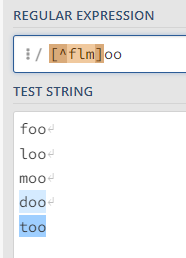

## Regular Expression
Regex/ Regexp: sequence of charater that define pattern search

### Basic set
| Symbol | What does it represent? |
|:------:|------------------------|
|* | Zero or more characters |
|. | Any character |
|\s | White space |
|[pqr]| Single character: 'p' or 'q' or 'r'|
|[a-d] | Single character from 'a' to 'd' |
| [^pq]| Single character neither 'p' nor 'q' |
|^pattern | Anchor tag: begginning og the line |
|pattern$ | Anchor tag: End of the line|

## Example
### Symbol *, .

### White space

### Character classes

### Exclude character classes

### Character range classes

### Escaping with Backslash

### Anchor
Beginning  

Ending  

