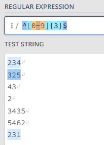

### Extended set
| Symbol | What does it represent? |
|:------:|------------------------|
|+ | One or more occurrences of character |
|? | Zero or one occurrence of character |
|pat1|pat2 | Matches either pattern pat1 or pat2 |
|()| Devide pattern into group|
|{} | Exactly 'm' occurrences of whatever precedes |
| {m,n}| From 'm' to 'n' occurrences. Only one 'm or 'n' is mandatory, other can be blank |

### Curly Braces Repeater
